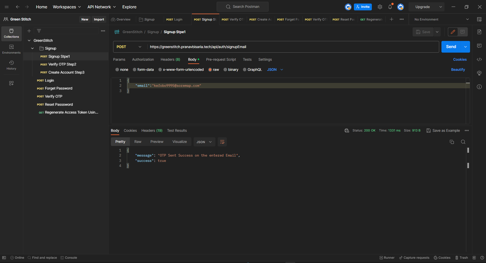
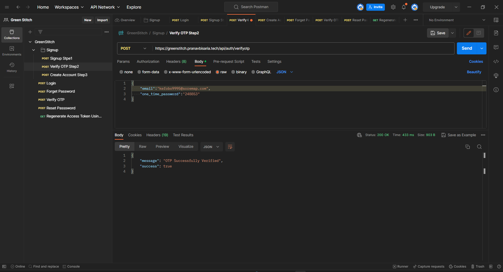

<!-- PROJECT SHIELDS -->
<a id="readme-top"></a>
[![Contributors][contributors-shield]][contributors-url]
[![Forks][forks-shield]][forks-url]
[![Stargazers][stars-shield]][stars-url]
[![Issues][issues-shield]][issues-url]
[![LinkedIn][linkedin-shield]][linkedin-url]

<!-- PROJECT LOGO -->
<br />
<div align="center">
  <a href="https://github.com/pranavbisaria/Login-Signup">
    
  </a>
<h3 align="center">Authentication</h3>

  <p align="center">
    This is a springboot application for login/signup along with the JWT token filter with access and refresh token and email OTP verification and caching using Guava cache.
    <br />
    <a href="https://github.com/pranavbisaria/Login-Signup"><strong>Explore the docs »</strong></a>
    <br />
    <br />
    <a href="https://greenstitch.pranavbisaria.tech/swagger-ui/index.html">View Demo</a>
    ·
    <a href="https://github.com/pranavbisaria/Login-Signup/issues">Report Bug</a>
    ·
    <a href="https://github.com/pranavbisaria/Login-Signup/issues">Request Feature</a>
  </p>
</div>

<!-- TABLE OF CONTENTS -->
<details>
  <summary>Table of Contents</summary>
  <ol>
    <li>
      <a href="#about-the-project">About The Project</a>
      <ul>
        <li><a href="#built-with">Built With</a></li>
      </ul>
    </li>
    <li>
      <a href="#getting-started">Getting Started</a>
      <ul>
        <li><a href="#prerequisites">Prerequisites</a></li>
        <li><a href="#installation">Installation</a></li>
      </ul>
    </li>
    <li><a href="#usage">Usage</a></li>
    <li><a href="#roadmap">Roadmap</a></li>
    <li><a href="#contributing">Contributing</a></li>
    <li><a href="#contact">Contact</a></li>
    <li><a href="#acknowledgments">Acknowledgments</a></li>
  </ol>
</details>


<!-- ABOUT THE PROJECT -->
<a id="about-the-project"></a>
## About The Project
<div style="border: 1px solid #575757;
    padding: 20px;
    overflow: hidden;
    max-width: 900px;
    width: 100%;
    margin: 0 auto;
    position: relative;
    display: flex;
    flex-wrap: wrap;
    justify-content: space-evenly;">
    
    
    
    
</div>
This is a springboot application for login/signup along with the JWT token filter with access and refresh token and email OTP verification and caching using Guava cache.

<p align="right">(<a href="#readme-top">back to top</a>)</p>


<a id="built-with"></a>
### Built With

* [![Springboot][Spring.io]][Springboot-url]
* [![JWT][JWT.io]][JWT-url]
* [![AWS][aws.amazon.com]][Amazon-url]

<p align="right">(<a href="#readme-top">back to top</a>)</p>


<!-- GETTING STARTED -->
<a id="getting-started"></a>
## Getting Started

This is an example of how you can use my APIs on setting up my project locally.
To get a local copy up and running follow these simple steps.

### Prerequisites
<a id="prerequisites"></a>

You only need to install the JAVA 17.0.5 LTS from Oracle, go to the following link and install for your operating system
*
```sh
https://www.oracle.com/java/technologies/javase/jdk17-archive-downloads.html
```

### Installation
<a id="installation"></a>

1. Get the JAVA 17.0.5: [https://www.oracle.com/](https://www.oracle.com/java/technologies/javase/jdk17-archive-downloads.html)
2. Clone the repo
   ```sh
   git clone https://github.com/pranavbisaria/Login-Signup.git
   ```
3. Open the cloned folder using STS, IntelliJ Idea or any other IDE, and it will auto download all the configuration files.
4. Run the project, the base URL for the project will be
   ```sh
   http://localhost:8080/
   ```
5. Get the documentation for the various APIs at the following link
   ```sh
   http://localhost:8080/swagger-ui/index.html
   ```
   Get the postman collection at the following link
   ```sh
   https://crimson-flare-571775.postman.co/workspace/Green-Stitch~dcfa712e-5f25-40e2-aedf-60b0e52bcca6/collection/24017701-6dfd191f-0f0c-46c0-a63c-d71dde765b9e?action=share&creator=24017701
   ```

<p align="right">(<a href="#readme-top">back to top</a>)</p>


<!-- USAGE EXAMPLES -->
<a id="usage"></a>
## Usage

This project includes all the APIs related to provide various functionality for a Auth in a website.

_For more examples, please refer to the [Documentation](https://greenstitch.pranavbisaria.tech/swagger-ui/index.html)_

<p align="right">(<a href="#readme-top">back to top</a>)</p>


<!-- ROADMAP -->
<a id="roadmap"></a>
## Roadmap

- [ ] Spring Boot Security
- [ ] JWT token (Access and Refresh Token)
- [ ] Role based user model
    - [ ] Admin
    - [ ] Normal
    - [ ] Other
- [ ] Component Based Security Model (2023)
- [ ] Asynchronous Method calling for faster API response
- [ ] Hosted on AWS EC2 VM
    - [ ] Springboot as a service

See the [open issues](https://github.com/pranavbisaria/Login-Signup/issues) for a full list of proposed features (and known issues).

<p align="right">(<a href="#readme-top">back to top</a>)</p>


<!-- CONTRIBUTING -->
<a id="contributing"></a>
## Contributing

Contributions are what make the open source community such an amazing place to learn, inspire, and create. Any contributions you make are **greatly appreciated**.

If you have a suggestion that would make this better, please fork the repo and create a pull request. You can also simply open an issue with the tag "enhancement".
Don't forget to give the project a star! Thanks again!

1. Fork the Project
2. Create your Feature Branch (`git checkout -b feature/AmazingFeature`)
3. Commit your Changes (`git commit -m 'Add some AmazingFeature'`)
4. Push to the Branch (`git push origin feature/AmazingFeature`)
5. Open a Pull Request

<p align="right">(<a href="#readme-top">back to top</a>)</p>

<!-- CONTACT -->
<a id="contact"></a>
## Contact

Pranav Bisaria - [@pranavbisaria29](https://twitter.com/pranavbisaria29) - [pranavbisariya29@gmail.com](mailto:pranavbisariya29@gmail.com)

Project Link: [https://github.com/pranavbisaria/Login-Signup](https://github.com/pranavbisaria/Login-Signup)

<p align="right">(<a href="#readme-top">back to top</a>)</p>


<!-- ACKNOWLEDGMENTS -->
<a id="acknowledgments"></a>
## Acknowledgments

* [https://start.spring.io/](https://start.spring.io/)
* [https://www.baeldung.com/spring-boot](https://www.baeldung.com/spring-boot)
* [https://www.baeldung.com/spring-boot-security-autoconfiguration](https://www.baeldung.com/spring-boot-security-autoconfiguration)

<p align="right">(<a href="#readme-top">back to top</a>)</p>

<!-- MARKDOWN LINKS & IMAGES -->
<!-- https://www.markdownguide.org/basic-syntax/#reference-style-links -->
[contributors-shield]: https://img.shields.io/github/contributors/pranavbisaria/Login-Signup.svg?style=for-the-badge
[contributors-url]: https://github.com/pranavbisaria/Login-Signup/graphs/contributors
[forks-shield]: https://img.shields.io/github/forks/pranavbisaria/Login-Signup.svg?style=for-the-badge
[forks-url]: https://github.com/pranavbisaria/Login-Signup/network/members
[stars-shield]: https://img.shields.io/github/stars/pranavbisaria/Login-Signup.svg?style=for-the-badge
[stars-url]: https://github.com/pranavbisaria/Login-Signup/stargazers
[issues-shield]: https://img.shields.io/github/issues/pranavbisaria/Login-Signup.svg?style=for-the-badge
[issues-url]: https://github.com/pranavbisaria/Login-Signup/issues
[license-shield]: https://img.shields.io/github/license/pranavbisaria/Login-Signup.svg?style=for-the-badge
[license-url]: https://github.com/pranavbisaria/Login-Signup/blob/master/LICENSE.txt
[linkedin-shield]: https://img.shields.io/badge/-LinkedIn-black.svg?style=for-the-badge&logo=linkedin&colorB=555
[linkedin-url]: https://www.linkedin.com/in/pranavbisaria
[Spring.io]: https://img.shields.io/badge/Spring_Boot-F2F4F9?style=for-the-badge&logo=spring-boot
[Springboot-url]: https://spring.io/
[JWT.io]: https://img.shields.io/badge/JWT-black?style=for-the-badge&logo=JSON%20web%20tokens
[JWT-url]: https://jwt.io/
[aws.amazon.com]: https://img.shields.io/badge/Amazon_AWS-FF9900?style=for-the-badge&logo=amazonaws&logoColor=white
[Amazon-url]: https://aws.amazon.com/
